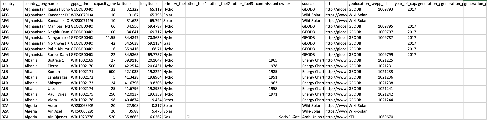
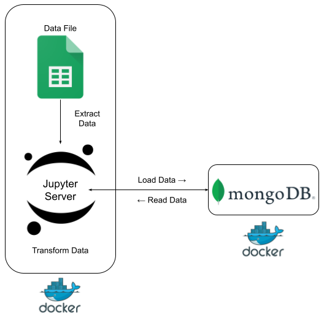
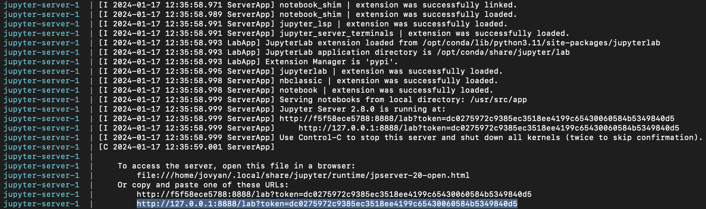
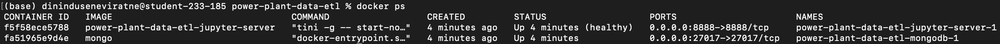

# Global Power Plant Data ETL - \#DPFromScratch01

This project is an attempt to learn to build _#DataPipelinesFromScratch_ using the following data engineering tools (in general).

1. Docker and Docker Compose
2. Jupyter Server and PyMongo
3. MongoDB

The use case is very basic and could be easily performed using a simpler approach; but since the objective is to get hands-on learning on different data engineering tools, the following approach is used.

## Goal

The goal is to extract [_Global Power Plant Data_](https://datasets.wri.org/dataset/globalpowerplantdatabase) data from a CSV file, do simple transformations to data fields and load them into a MongoDB server.

The CSV file at `data/global_power_plant_database.csv` which is the datasoure, has the following structure:



The format we are going to transform the data to and load to MongoDB:

```
{
        'country_id': '',
        'country_name': '',
        'plant_name': '',
        'gppd_id': '',
        'capacity_mw': 0.0,
        'latitude': 0.0,
        'longitude': 0.0,
        'fuel_source': {
            'primary': '',
            'secondary': '',
            'tertiary': '',
            'quaternary': ''
        },
        'commissioning_year': '',
        'owner': '',
        'data_source': '',
        'data_source_url': '',
        'actual_generation': {
            'generation_gwh_2013': 0.0,
            'generation_gwh_2014': 0.0,
            'generation_gwh_2015': 0.0,
            'generation_gwh_2016': 0.0,
            'generation_gwh_2017': 0.0,
            'generation_gwh_2018': 0.0,
            'generation_gwh_2019': 0.0
        },
        'estimated_generation': {
            'estimated_generation_gwh_2013': 0.0,
            'estimated_generation_gwh_2014': 0.0,
            'estimated_generation_gwh_2015': 0.0,
            'estimated_generation_gwh_2016': 0.0,
            'estimated_generation_gwh_2017': 0.0
        }
    }
```

## Method and Architecture

First the following docker network needs to be created with two containers:

1. Container 1 - carrying our Jupyter server and our data file
2. Container 2 - carrying our MongoDB server

<div style="text-align:center">
  
</div>


Once the containers containing the servers are up and running, the script available in `jupyter/notebooks/gpp-etl.ipynb` will run the ETL process.

The loaded data (in MongoDB) can be accessed through any notebook created in the Juoyter server and you can start off with `jupyter/notebooks/your-analysis.ipynb`.

## How to Run

To successully run this project, follow the steps given below.

1. Install Docker in your PC or VM

* If you are using Windows, Mac or Linux, you can do this by installing [Docker Desktop](https://www.docker.com/products/docker-desktop/).
* If you are using a VM or other platforms refer [here](https://docs.docker.com/engine/install/).

NOTE: You will have to install Docker Compose separately via --> [Installing Docker Compose](https://docs.docker.com/compose/install/)

NOTE: Make sure to check if Docker Engine is running before starting the project by either checking Docker Desktop or by using `docker info` command.

2. Clone this repository using:

`git clone https://github.com/dininduviduneth/power-plant-data-etl.git`

3. Navigate into the root of the repository in your machine and run the following commands in the terminal.

`docker-compose up --build` - This will build and start the two containers and navigate into the Jupyter server terminal.

Copy the URL shown below (in the case of your terminal) and paste it in your browser to access the Jupyter Server UI.



If you check in a different terminal using `docker ps -a`, you should see the two containers running as follows.



Use the script in `gpp-etl.ipynb` file in Jupyter Server UI to run the ETL. Once the data is loaded into MongoDB, you can use any notebook to access it's data and play around with it.

## Port Bindings

The port `8888` which the Jupyter server is using is bound to `localhost:8888` which is why the notebooks can be accessed by the browser in your local machine.

The port `27017` used by MongoDB is bound to `localhost:27017` which can be used to access the database using your terminal or a tool like Studio 3T.

## Shutting Down

To shut down the containers, simply use `docker-compose down` which will immediately shut down and delete the containers.

To clean up the images, you can use `docker rmi $(docker images -aq)`.

# Enjoy pipelining! :)